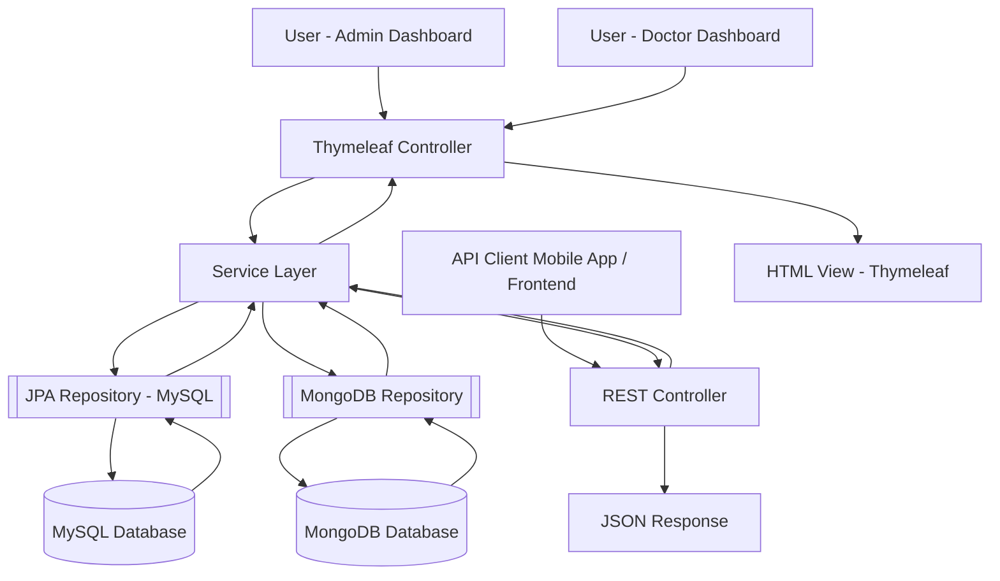

# Smart Clinic Management System Architecture

## Section 1: Architecture Summary
The Smart Clinic Management System is built using Spring Boot and follows a three-tier architecture pattern: **Presentation Layer**, **Application Layer**, and **Data Layer**.

- The **Presentation Layer** consists of Thymeleaf-based dashboards for Admin and Doctor views, as well as REST API clients for modules like appointments and patient records. Thymeleaf renders dynamic HTML pages on the server, while REST APIs return JSON responses for mobile or external consumers.
- The **Application Layer** contains Spring MVC controllers (both Thymeleaf controllers and REST controllers) that route user requests to a **Service Layer**. This Service Layer enforces business logic, validates data, and coordinates workflows.
- The **Data Layer** interacts with two databases:
  - **MySQL** using Spring Data JPA for structured, relational entities like patients, doctors, appointments, and admin data.
  - **MongoDB** using Spring Data MongoDB for flexible, document-based prescriptions.
  
This architecture promotes scalability, maintainability, and separation of concerns. All controllers delegate to services, which then call repositories for database operations. Models from both databases are returned to the controller and either passed to Thymeleaf views or converted into JSON responses for API consumers.

---

## Section 2: Numbered Flow of Data and Control

1. **User Interaction**: The user interacts with the system via a Thymeleaf dashboard (Admin or Doctor) or through a REST API client (mobile app or frontend modules).
2. **Controller Handling**: The request is routed to either a Thymeleaf controller (for HTML rendering) or a REST controller (for JSON responses).
3. **Service Invocation**: The controller delegates the request to the Service Layer, which applies business rules and validates inputs.
4. **Repository Access**: The Service Layer communicates with the appropriate repository to retrieve or persist data. There are two repository types:  
   - JPA repositories for MySQL (structured data)  
   - MongoDB repositories for prescriptions (unstructured data)
5. **Database Operation**: The repositories execute queries or updates on the corresponding database (MySQL or MongoDB).
6. **Model Binding**: Retrieved data is mapped into Java model classes—JPA entities for relational tables and @Document classes for MongoDB collections.
7. **Response Generation**: The controller uses the models to generate a response:  
   - Thymeleaf templates for dashboards  
   - JSON payloads for REST clients.

---

